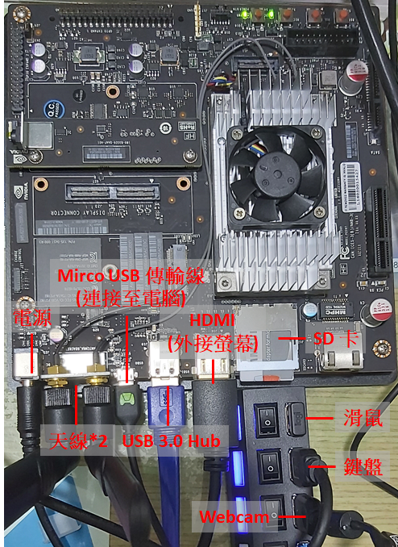

# NVIDIA Jetson TX1
Jetson TX1 嵌入式系統模組為 NVIDIA 所開發，適合在低功率限制且需要高度運算效能的應用

## 配備
- [x] NVIDIA Jetson TX1 （含天線\*2、Adapter\*1組）
- [x] USB 3.0 Hub（含外接電源線\*1）
- [x] Mirco USB 傳輸線
- [x] HDMI to VGA
- [x] Webcam C270 HD

## 刷機
在使用之前必須先進行刷機，主要用以刷新系統及安裝必要軟體  
透過 NVIDIA 的 [SDK Manager](https://developer.nvidia.com/nvidia-sdk-manager) 按步驟操作即可完成刷機  
:warning:**注意：**  
SDK Manager 必須在 Ubuntu 系統下操作，若沒有 Ubuntu 也可利用虛擬機，但硬碟必須配置大約 60~70GB
| 系統 | 需求 |
| -------- | -------- |
|Host OS|Ubuntu Desktop 16.04 and 18.04 on x64 system|
|Dependencies|Requirements vary depending on the deployed SDK.|
|Hardware|RAM 8GB|
|Internet|Connection|

---

### :pushpin: 設置 SD 卡請看[這篇](SD-Card_setting.md)
### :pushpin: Anaconda 安裝請看[這篇](Anaconda_download.md)
### :pushpin: PyCharm IDE 安裝請看[這篇](PyCharm.md)
### :pushpin: TensorFlow 下載請看[這篇](TensorFlow_install.md)
### :pushpin: 遠端連線設定請看[這篇](VNC_connect.md)
